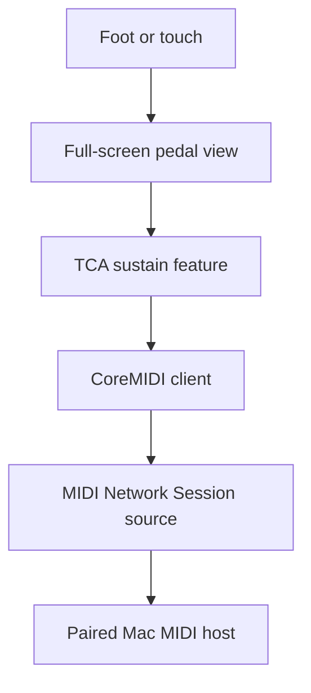

# feat: Build iPad MIDI sustain pedal

## Goal Capsule

- **Objective:** Let a musician use a full-screen iPad control as a dependable sustain pedal for MIDI software on their Mac.
- **Means:** An iPadOS 17+ SwiftUI interface driven by The Composable Architecture and CoreMIDI's MIDI Network Session (KTD1, KTD2).
- **Authority:** User request, then Apple CoreMIDI platform constraints and project conventions.
- **Stop conditions:** Do not add unrelated instrument controls, account features, or custom MIDI routing configuration.
- **Execution profile:** Device-facing iPad app with simulator coverage for reducer and UI state plus a physical iPad/Mac network-MIDI smoke test.

---

## Product Contract

### Summary

Build an iPad-only virtual sustain pedal whose single large touch surface sends the standard MIDI sustain controller on press and release.

### Problem Frame

Existing MIDI sustain pedals require dedicated hardware. A musician needs a fast, foot-operated alternative that can sit on an iPad while controlling their Mac music software.

### Requirements

- R1. The iPad app displays one dominant pedal control that fills the usable screen area and is safe to press with a foot.
- R2. Pressing the pedal sends MIDI channel 1 control-change 64 with value 127; releasing it sends control-change 64 with value 0.
- R3. The visual state, accessible control semantics, and haptic feedback clearly distinguish pedal-down from pedal-up; unsupported haptics degrade silently.
- R4. The app enables the system-provided CoreMIDI network session, makes its source available to a paired Mac, and displays its advertised name and connection state.
- R5. A brief status treatment tells the musician whether network MIDI is ready, connected, unavailable, or failed, without competing with the pedal.
- R6. Losing app focus, the scene becoming inactive, or a disappearing pressed gesture releases sustain exactly once to avoid a stuck note.

### Actors

- A1. Musician operating the iPad with a foot.
- A2. Mac MIDI host receiving sustain control messages through the CoreMIDI network session.

### Key Flow

- F1. The musician opens the app, pairs the iPad session in macOS Audio MIDI Setup, then holds and releases the on-screen pedal while the Mac host responds to sustain on and off messages.

### Acceptance Examples

- AE1. Given a connected Mac session, when the musician touches and holds the pedal, the host receives CC 64 value 127 and the pedal visibly remains down.
- AE2. Given the pedal is down, when the touch ends or the app backgrounds, the host receives CC 64 value 0 exactly once.

### Scope Boundaries

- No per-channel selector, MIDI learn, note controls, audio generation, persistence, or account features in this release.
- **Deferred for later:** Bluetooth MIDI, automatic peer selection, external-switch input, and configurable CC mapping.

---

## Planning Contract

### Key Technical Decisions

- KTD1. **Use CoreMIDI's MIDI Network Session as the Mac transport.** iPadOS does not let a normal app present itself as a general USB MIDI device to macOS; enabling the system-provided session is the supported built-in path for a Mac paired through Audio MIDI Setup. The session's advertised names are system-owned, so the UI displays them rather than trying to rename them. Governs R4.
- KTD2. **Publish MIDI 1.0 CC messages from the network-session source using `MIDIReceivedEventList`.** Build a MIDI 1.0 UMP event list and pass it to `MIDINetworkSession.default().sourceEndpoint()`, checking the returned `OSStatus`; this is source emission, not `MIDISendEventList` destination delivery. Governs R2, R4.
- KTD5. **Use an iPadOS 17 minimum and trusted-LAN network policy.** TCA's current support floor is compatible with iPadOS 17, while CoreMIDI event-list APIs require iOS 14+. The session permits trusted local-network peers to connect (`.anyone`) so macOS pairing works without in-app host management; local-network permission denial leaves MIDI unavailable. Governs R4, R5.
- KTD3. **Use press-and-hold gesture semantics rather than a toggle.** Sustain should map to physical-pedal behavior; every cancellation path produces an off message. Governs R1, R2, R6.
- KTD4. **Keep state and side effects in a small TCA feature.** Reducer tests can prove send-once behavior independently of CoreMIDI hardware. Governs R2, R5, R6.

### High-Level Technical Design

### Assumptions

- The iPad and Mac can join the same trusted local network and the musician will pair the system-provided session in macOS Audio MIDI Setup.
- The target iPad runs a supported iPadOS version and Xcode can sign the app with the connected developer account.

### Risks and Mitigation

- Network pairing is a host setup step: show a compact readiness/connection state and document the Mac pairing steps.
- A forceful or interrupted touch could leave sustain active: route gesture cancellation and inactive scene changes through the same idempotent release action.

---

## Implementation Units

### U1. Bootstrap the iPad application

- **Goal:** Create a signable iPadOS SwiftUI project with TCA and the required privacy metadata.
- **Requirements:** R1, R4.
- **Dependencies:** None.
- **Files:** `IPadSustainPedal.xcodeproj/project.pbxproj`, `IPadSustainPedal/App/IPadSustainPedalApp.swift`, `IPadSustainPedal/Info.plist`, `IPadSustainPedal/Assets.xcassets`.
- **Approach:** Target iPadOS 17, landscape and portrait, add the Composable Architecture through Swift Package Manager, and declare `NSLocalNetworkUsageDescription` plus the `_apple-midi._udp` Bonjour service in privacy metadata.
- **Test scenarios:** Build the app for an iPad simulator; verify the app launches to the pedal screen.
- **Verification:** Xcode reports a clean iPad build and the simulator has a full-screen root view.

### U2. Implement CoreMIDI network-sustain client

- **Goal:** Encapsulate network-session lifecycle, connection status, and standard sustain on/off emission behind an injectable dependency.
- **Requirements:** R2, R4, R5, R6.
- **Dependencies:** U1.
- **Files:** `IPadSustainPedal/MIDI/MIDIClient.swift`, `IPadSustainPedal/MIDI/MIDIClient+Live.swift`, `IPadSustainPedalTests/MIDIClientTests.swift`.
- **Approach:** Enable `MIDINetworkSession`, set the trusted-LAN connection policy, display the system-provided advertised name, observe its connection state, and publish MIDI 1.0 channel-one CC 64 packets by calling `MIDIReceivedEventList` on its source endpoint. Treat a nonzero `OSStatus` and a denied local-network permission as unavailable or failed state.
- **Execution note:** Use a mock dependency for reducer tests; the hardware API is proven by the device smoke test.
- **Test scenarios:** A request to send sustain-on builds CC 64 value 127; a request to send sustain-off builds CC 64 value 0; unavailable transport reports failure; a nonzero emission result becomes failed state; the displayed name comes from the system session rather than a mutable app setting.
- **Verification:** Client-contract tests pass and the client compiles against the chosen iPadOS SDK.

### U3. Build the full-screen pedal interaction

- **Goal:** Make the only meaningful interaction a large, responsive, accessible pedal surface.
- **Requirements:** R1, R3, R5, R6.
- **Dependencies:** U2.
- **Files:** `IPadSustainPedal/Sustain/SustainFeature.swift`, `IPadSustainPedal/Sustain/SustainPedalView.swift`, `IPadSustainPedalTests/SustainFeatureTests.swift`.
- **Approach:** Send press, release, and cancellation actions from a full-screen SwiftUI control; let the reducer own visual and transport state and make release idempotent. The pedal owns every non-status pixel inside the safe area; status overlays at the top edge without becoming a competing touch target in either orientation. A send failure returns the visual pedal to up, gives an error haptic only when supported, and shows a non-blocking failure state until a later successful preparation or press restores readiness. Press and release use differentiated, supported-device haptics; forced cancellation is silent. Expose one accessible button named "Sustain Pedal" with an "Up" or "Down" value, and announce status changes without moving VoiceOver focus.
- **Test scenarios:** Covers AE1. Touch-down on a ready pedal sets pressed state, requests sustain-on, and produces the down feedback. Covers AE2. Touch-up, cancellation, and inactive scene each yield at most one sustain-off. A press while unavailable does not visually latch down and exposes failure. A send failure clears the pressed state. Both orientations leave the entire non-status safe area as the pedal target. Accessibility exposes the button role, name, and current up/down value.
- **Verification:** Reducer tests pass and simulator interaction visibly changes pedal state.

### U4. Validate simulator and physical-device handoff

- **Goal:** Produce repeatable simulator evidence and a concise Mac/iPad setup check for live MIDI validation.
- **Requirements:** R1-R6.
- **Dependencies:** U1, U2, U3.
- **Files:** `README.md`.
- **Approach:** Capture the build and simulator checks, then document the short physical test: connect iPad for signing/deployment, pair the named session in Audio MIDI Setup, and observe CC 64 in a MIDI monitor or host.
- **Test scenarios:** Simulator launch, pressed/unpressed visual states, status copy, app-inactive release behavior, physical Mac receipt of CC 64 values 127 and 0.
- **Verification:** Simulator build/launch succeeds; device-only checks are explicitly ready to run when the iPad is attached.

---

## Verification Contract

| Gate | Applies to | Passing evidence |
| --- | --- | --- |
| Unit tests | Sustain reducer and MIDI client contracts | `xcodebuild test` succeeds on an iPad simulator destination. |
| Build | App target | `xcodebuild build` succeeds for an iPad simulator. |
| Simulator UI smoke | Pedal interaction | Launch succeeds; down/up state is visibly distinct and status remains secondary. |
| Physical MIDI smoke | Network transport | Paired Mac host receives CC 64 127 on press and 0 on release. |
| Device deployment | Signed iPad app | The attached iPad installs and launches the app. |

---

## Definition of Done

- Each implementation unit's verification result is observed and recorded.
- The app builds and its reducer tests pass for the selected iPad simulator.
- The full-screen pedal never behaves as a toggle; it releases sustain on every interruption path.
- The README makes the Mac network-MIDI pairing and physical validation unambiguous.
- Once an iPad is connected, the remaining signing, installation, and MIDI smoke check can be run without design or code decisions.
